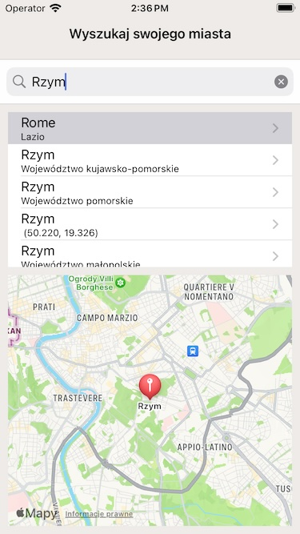

# Pogodynka 🌦

**Pogodynka** is a simple weather application that displays the current weather for a user-specified location. Built with a clean and user-friendly interface, it provides real-time weather information for cities around the world. My main focus was to use it by default for poland area. That's why default map location presents poland border on map. You are welcomed to use it for learning purposes.

## Features

- **Modern Architecture**: It is an example how to use MVVM+C architecture.
- **Unit Tests** Classes are covered by unit tests to present how screen logic can be verified using mocked data.  
- **Weather API**: Get up-to-date weather information based on the latest data from open weather API.
- **Location Search**: Search for weather in any location worldwide.
- **User-Friendly Interface**: Clean and straightforward UI for easy navigation.

## Screenshots

  
*Add a screenshot here to show the application in action.*

## Installation

To get started with Pogodynka locally, follow these steps:

### Prerequisites

If you plan to start using open weather 
- [API Key](https://openweathermap.org/api) from OpenWeather web page

## Technologies Used

- **Combine**: Combine apple framework for reactive programing.
- **MapKit**: Map view for location presentation.
- **OpenWeather API**: Fetches real-time weather data.

## License

This project is open-source and available under the [MIT License](LICENSE).
